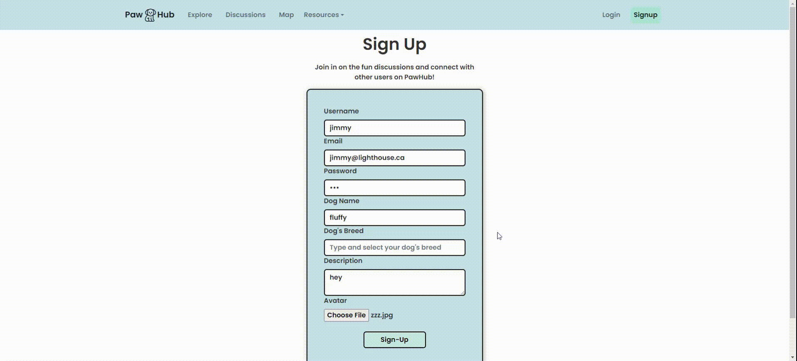

# PawHub

PawHub is a web application that helps pet owners connect with other pet owners, find local resources for their pets, and learn about different breeds and pet care. This project includes a discussion board, explore page, map page, and a resources section, which includes a breed information page, and a video page.

## Tech Stack

Pawhub was built with React, React Router, Ruby on Rails as a back-end API, PostgreSQL, Bootstrap and Material UI, and Axios. This project was also made possible with Google's [Map Platform](https://developers.google.com/maps), Youtube's [Data API](https://developers.google.com/youtube/v3), and a dog breeds API by [Mirwn Apostolakis](https://rapidapi.com/myapos--FqlEzvrlv/api/dog-breeds2/).

## Features

- **Discussion Board**: Users can create posts, comment, and engage in discussions with other pet owners about meetups, swaps, and other topics related to pets.

- **Profile Page**: Users can edit their own profiles, with the ability to add, or remove, pictures from their profile feed, and update their user details.

- **Explore Page**: A carousel containing all the images from user profiles. Users can click on any given photo to be directed to the user's profile.

- **Map Page**: Users can find the closest veterinarians or pet stores based on their inputted location.

- **Resources Section**:
  - **Breed Information Page**: Users can search for any dog breed and it will provide a picture, country of origin, and a link to the Wikipedia page of that dog.
  - **Video Page**: Users can watch YouTube videos for dog training and dental health.

## Demo

### Discussion Page

### Profile Page

### Carousel Page

### Map Page

### Breed Page

### Video Page

### Signup and Login Pages

## Installation

To install this project, follow these steps:

1. Clone this repository
2. Navigate to pawhub-frontend, and run `npm install` to install dependencies
3. Navigate to pawhub-rails, and run `bundle install` to install dependencies

This project requires 3 API keys to run: Youtube API key, Google Maps API key, and a [Dog Breeds](https://rapidapi.com/myapos--FqlEzvrlv/api/dog-breeds2/) API key.

5. Create an `api_keys.js` file under `pawhub-frontend/src/components/`, and create an API_KEY object with keys: youtubeAPIKey, googleAPIKey, and a dogBreedAPIKey. Use your own API keys as the values for this.

To start the server, you would need two windows open in your terminal: one for the front end, and the other for the Rails API back end.

7. Run `bin:rails start` in the pawhub-rails directory, then run `npm start` in the pawhub-frontend directory.

8. Make some new furry friends!!
